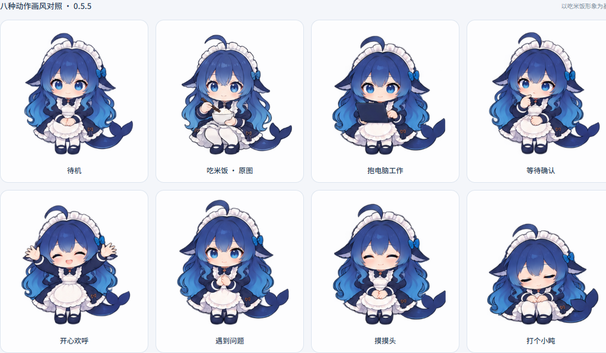
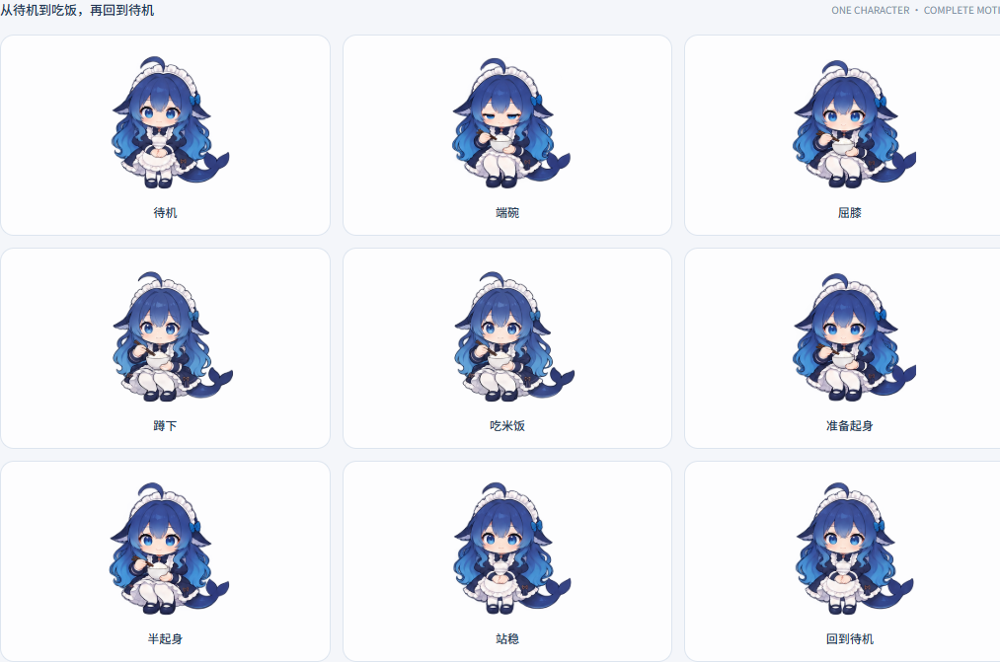
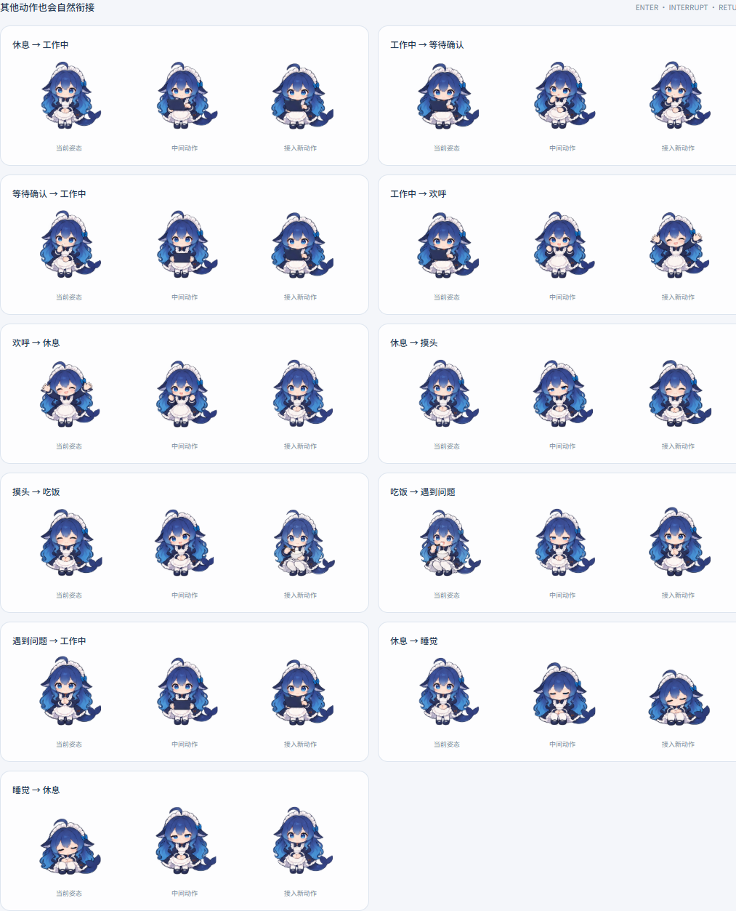

# 鲸鱼娘 · DSH 原生桌宠

蓝色渐变长发、女仆头饰、鲸鱼围裙和大鲸尾，按用户提供的鲸鱼娘参考图制作。
基于 [Yifffan/dsh-plugin-whale-pet 0.2.9](https://github.com/Yifffan/dsh-plugin-whale-pet) 的 MIT 代码框架改编，
通过 [DeepSeek Harness](https://github.com/deepseek-ai/deepseek-harness) 的原生插件机制挂载到 `shell.overlay`。
她生活在 DSH 窗口内，随窗口移动；适用于 DSH Web 界面和加载该界面的 Desktop。

## 安装

从 [GitHub Releases](https://github.com/zanedonkey/dsh-plugin-whale-girl/releases/latest) 下载安装包，保存到本机。0.5.6 的文件名为 `dsh-plugin-whale-girl-0.5.6.tgz`；新版本发布前可在对应 [Actions](https://github.com/zanedonkey/dsh-plugin-whale-girl/actions) 验证运行中下载 `installation-package`。

在 DSH 的 **插件 → 添加插件** 中输入下载文件的绝对路径。例如：

```text
D:\下载\dsh-plugin-whale-girl-0.5.6.tgz
```

安装后启用“鲸鱼娘”。涉及 Host 桥接的首次安装／升级，请等当前任务结束，完整退出 DSH 再重新打开。
也可以下载并解压本仓库，输入解压后项目目录的绝对路径；已包含预编译的 `lib/`，无需在 DSH 中构建。
包名尚未发布到 npm，不能仅填 `dsh-plugin-whale-girl` 从公共仓库安装。

## 使用

- 拖动搬家，单击后蹲在地上端碗吃米饭；长按头部 **0.7 秒** 摸头，会出现爱心和随机小台词。
- 吃饭、摸头各有六句开朗搞笑的台词，同类互动不会连续重复。所有状态的对话气泡共用内置圆润字体、淡蓝背景和圆角；中英文字形离线嵌入。
- 拖动、取消按压或失去指针捕获会取消长按；摸头结束后的点击不会再触发一次吃饭。
- `P` 摸头，`C` 吃饭。接入动作后摸头持续约 2.8 秒；吃饭循环约 4.8 秒，准备约 0.9 秒、收尾约 0.7 秒（总计约 6.4 秒）。切换前会先收回手臂或放下道具；工作、等待确认、报错和庆祝优先显示。
- 位置、大小和设置保存在客户端本地。
- 右键或 Enter 打开设置；方向键移动，Shift + 方向键加大步幅。
- 切换当前／全局会话；全局范围覆盖当前连接 Host 上的普通主会话。
- 大小范围 65%～160%，可关闭轻柔动画；尊重系统减少动画设置。
- 设置面板会选择人物上下或两侧的空位；打开时暂时收起台词气泡，关闭后恢复。键盘焦点使用柔和蓝色边线。
- 空闲 30 秒、2 分钟或 5 分钟后休眠；隐藏后可点“唤回鲸鱼娘”恢复。

| 姿态 | 行为 |
| --- | --- |
| 待机 | 微笑站立、眨眼、左右张望、歪头与小幅挥手 |
| 工作 | 抱电脑逐帧打字；显示工作会话数量 |
| 等待 | 歪头等你确认；优先于工作提示 |
| 庆祝 | 成功完成任务后举手欢呼 |
| 出错 | 担心的表情，提示查看任务 |
| 睡觉 | 闭眼坐着休息；点击唤醒 |

0.5.4 以已批准的吃饭图重新制作待机、蹲下／起身、打字、摸头、等待、庆祝、报错和睡觉四组图集，统一眼睛高光、发色、线条和衣服阴影。吃饭图保留原样。点击先保留当前待机姿态，准备末帧、吃饭首帧和起身首帧共用同一张吃饭图，避免切换时跳位。
蹲下与起身按实际脸部高度及鞋底校准，移除下蹲过深后反弹的姿态；人物大小与脚底基准保持稳定。
单击按“待机 → 端碗蹲下 → 吃饭 → 起身放碗 → 待机”播放；逐帧使用同一身体中心与脚底基准，单张不透明图播放，连续点击不会重新站起。
起身末帧停留缩短到 70ms，收尾后直接接入张望前的待机姿态，80ms 后继续轻微动作；不再重播待机开头的 2.4 秒静止段。日常待机仍保留自然停顿。
所有动作以用户指定的吃饭图为画风基准，统一脸型、眼睛和阴影。
0.5.5 替换会突然变窄的端碗帧，并按实际人物轮廓微调吃饭和过渡的显示比例；从待机到端碗不再突然缩小，起身时使用对应的反向姿态。校准同时检查整个人物轮廓、脸部与脚底，图片原始像素保留。
八种动作之间使用绘制的进入与退出姿态：收好电脑、收回手臂、放碗起身、坐下入睡和起身唤醒。动作被打断时从当前显示的姿态继续衔接；回到待机后直接接入轻微动作，避免重新等待长静止段。
真实任务状态和提示即时更新，人物随后完成短暂收尾并接入新动作。等待、报错和睡觉在进入姿态后停止逐帧刷新。
播放改用屏幕同步刷新，最多每秒渲染 60 次，相邻动作使用清晰的单张绘制帧，避免半透明叠影；吃饭动作图每秒 10 张，1.6 秒一轮。刷新率与动作图数量分别影响流畅度，实际刷新随设备而定。
关闭“轻柔动画”或启用系统减少动画设置时，逐帧播放也会停止。
按照用户选择，本版保持静音，不包含语音、音效或音频下载。

完成提示来自 Host 的实时 `turn/end` 事件。取消、历史记录、重连和运行数量减少不会误触发庆祝。
桥接只传递状态所需的任务边界元数据，不添加模型调用、端口或遥测。
角色 PNG 与字体嵌入客户端，无运行时 CDN 请求。

## 预览与开发

双击 `preview/index.html` 即可离线查看六种姿态，并模拟工作、确认、完成、取消、报错和并行会话。
右下角使用同一套交互组件；下方有动画、完整吃饭动作顺序和其他动作过渡对照，也可用摸头／吃饭按钮体验互动。
预览模拟任务事件，不能证明真实 DSH 中的事件投递。

Node.js 22+：

```powershell
npm ci --ignore-scripts
npm run build
npm test
npm run pack:checked
```

`pack:checked` 在 `artifacts/` 生成安装包、同名 `.sha256` 校验文件和 `package-report.json`，检查全部发布文件、导出入口与体积上限。安装包只包含预编译运行代码、图标、语言资源、内嵌字体的原始文件及授权文档；原始 PNG、参考图和历史图集保留在源码仓库，不重复打包。0.5.6 安装包约 14.7 MB，解包约 19.8 MB；仍可完全离线运行。

浏览器回归检查需要独立的 Chrome/Chromium 可执行文件路径：

```powershell
$env:CHROME_PATH = 'C:\Program Files\Google\Chrome\Application\chrome.exe'
npm run test:browser
```

GitHub Actions 在 push、pull request 和手动触发时，检查 Windows / Node 22、Linux / Node 22 和 Linux / Node 24 的构建、测试及打包内容，并检查提交的 `lib/` 与 `preview/` 是否与源码一致。Linux / Node 22 另运行隔离的离线浏览器检查。发布匹配 `package.json` 版本的 `v` 标签（例如 `v0.5.6`）时，全部检查通过后自动创建或更新 GitHub Release，上传安装包及 SHA-256 校验文件；不发布到 npm。

修改 `src/` 后重新构建。`assets/whale-girl-atlas.png` 和 `assets/whale-girl-animation.png` 为历史素材与兼容回退；`src/sprites.js` 定义历史静态裁切。
`assets/active-atlases.json` 集中指定当前五张图集：四张 `*-054.png` 保存重绘的待机、过渡、动作与表情，`whale-girl-eating-smooth.png` 保存已批准的 16 帧吃饭图。旧图保留作历史记录，不参与完整动作模式的播放。生成提示词见 `assets/style-054-prompts.json`。
`src/motion.js` 管理动作切换和中途打断；`src/animation.js` 定义基础播放时长；`src/registration.js` 保存逐帧鞋底与中心校准，`tools/register-frames.mjs` 从原始 PNG 的透明通道测量，不修改图片像素。
`src/i18n.js` 为中英文案；`src/pet.css` 为动画与菜单样式；
`src/host-bridge.js` 与 `src/bridge-client.js` 为 DSH 状态桥接。
包名、入口 `whale-girl-pet`、服务 `whaleGirlPet` 和本地存储键均独立，可与原版小鲸鱼共存。

## 验证范围

已通过构建、288 项自动测试和离线浏览器检查。测试覆盖真实代码中的事件过滤、重连、
并行会话、取消、设置、拖动、键盘操作与卸载，以及长按阈值、取消、互动优先级、
动画帧切换、单一刷新回调、隐藏／拖动／卸载停止刷新和减少动画设置。浏览器检查使用真实鼠标按压验证长按、单击吃饭、16 帧循环、单张不透明绘制、固定脚底坐标、准备／收尾、重复点击不重启和屏幕同步刷新；八种动作间的 56 种有向切换均通过浏览器检查，自动测试另覆盖连续打断与反向切换。
已在本机 DSH 实际检查 0.5.2 的吃饭、摸头快捷键、拖动、大小调整和自然休眠。0.5.3 修复设置面板遮挡；0.5.4 重绘四组角色素材；0.5.5 修复端碗阶段突然缩小，新增实际 PNG 轮廓检查。新版通过离线验证，尚未安装到真实 DSH。
DSH 处于开发预览阶段，接口后续可能变化；参考框架最初面向 Desktop 0.1.6-alpha.2。

0.5.6 保留动画与任务状态的检查时序，仅在内容变化时更新台词、工作数量和辅助朗读标签；气泡在文字、位置、窗口、尺寸、字体或图片加载变化时重新定位。新增测试覆盖缓存后的休眠、唤醒、完成提示过期、语言切换和窗口调整。已通过隔离浏览器检查，尚未安装到真实 DSH。

代码保留上游 MIT 版权声明，见 `LICENSE`；角色与参考图说明见 `ASSETS-LICENSE.md`，
字体授权见 `FONT-LICENSES.md`。素材生成记录与提示词见 `assets/GENERATION.md`。


## 动作预览






